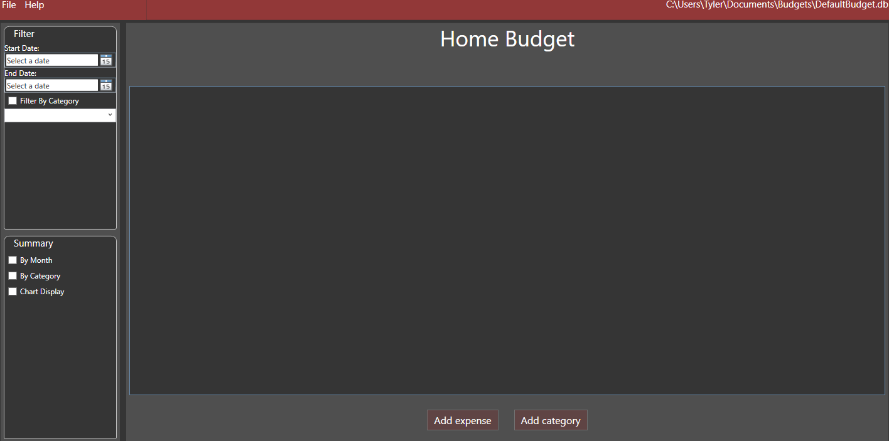

  

A budget application for small households, developped using WPF and an SQLite database. It was created by myself, Chase Lipari and Julian Hernandez Delgado, two of my fellow classmates in our Application Developpment 1 class. Which involved use practicing SCRUM Developpment as well as developpment of a WPF application through out the semester.
The application saves inputed expenses and incomes and is able to represent this data through tables and graphs to help households better keep track of their finances.
  

## Contributors ✨

<!-- ALL-CONTRIBUTORS-LIST:START - Do not remove or modify this section -->
<!-- prettier-ignore-start -->
<!-- markdownlint-disable -->
<table>
  <tr>
    <td align="center">
    <a href="https://github.com/Chase-Lipari">
    
     
    <b>Chase Lipari</b>
  </tr>
  <tr>
    <td align="center">
    <a href="https://github.com/julian-hzd">
    
     
    <b>Julian Hernandez</b>
  </tr>
  <tr>
    <td align="center">
    <a href="https://github.com/2076242">
    
     
    <b>Tyler Johnson</b>
  </tr>
</table>
